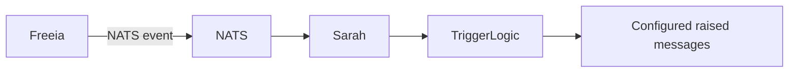

# Specification - Network Device Events

## Status

Proposed. This specification defines the network event contract required by home automation. It does not migrate or redesign Freeia.

## Objective

This specification defines the network event contract required by home automation. Freeia remains the current network event producer; its detection logic is kept in place while its direct trigger API call is replaced by a NATS notification.

Freeia is the current producer and Sarah is the consumer. The migration is limited to replacing Freeia's direct API notification with the shared NATS event.

## Scope

This specification covers:

- detection of a network device connection state change by Freeia;
- publication of a normalized NATS event;
- consumption by Sarah;
- matching against home automation triggers;
- trigger raising and configured side effects;
- migration of Freeia's notification path without changing its network detection.

This specification does not cover:

- Freebox administration or WAN monitoring;
- redesign of Freeia's network scanning implementation;
- Shelly protocol communication;
- device ownership or catalog persistence;
- replacement of Freeia;
- presence detection based on people, phones or accounts.

## Existing responsibilities

Freeia currently owns the historical network and infrastructure behavior, including Freebox integration and network device discovery. Its detection and state tracking behavior must remain unchanged. Only the notification path for home automation triggers changes.

1. Freeia detects a state transition using its existing network scan;
2. Freeia publishes the normalized event described below;
3. Sarah consumes the event;
4. Sarah raises matching triggers through `TriggerLogic.RaiseAsync`.

No component is required to call the home automation API directly to raise a trigger.

## Target topology

Freeia remains the sole producer for these observations. A second producer must not be introduced for the same devices and transitions.

## Event contract

The shared contract is `NetworkDeviceConnectionChangedMessage`.

| Field | Type | Required | Meaning |
|---|---|---:|---|
| `Topic` | string | yes | Always `system.network.device.connection.changed` |
| `DeviceId` | string | recommended | Stable technical identifier, preferably the normalized MAC address or another stable network identity |
| `DeviceName` | string | no | Human-readable name or hostname |
| `IpAddress` | string | no | Current IPv4 or IPv6 address |
| `MacAddress` | string | no | Device MAC address when available |
| `Vendor` | string | no | Manufacturer when known |
| `Model` | string | no | Model when known |
| `IsConnected` | bool | yes | `true` when reachable/present, `false` when considered absent |

The current shared type lives in `packages/MaNoir.HomeAutomation.Contracts/Messages/NetworkDeviceConnectionChangedMessage.cs`.

### Identity rules

- `DeviceId` is the primary matching key.
- `MacAddress` should be normalized to lowercase and use one consistent separator format when used as the identifier.
- A producer must keep the same `DeviceId` across IP changes.
- `DeviceName` is a fallback matching value for legacy or manually configured triggers.
- An IP address alone must not be used as a stable identity.

## Event semantics

The event represents a state transition, not a periodic presence sample.

Freeia should publish:

- one event when a device changes from disconnected to connected;
- one event when a device changes from connected to disconnected;
- no repeated event while the state is unchanged;
- a fresh `connected` event after a restart when the current state is known and differs from the persisted/in-memory state.

The event system is at-least-once delivery. Consumers must tolerate duplicate events. Sarah may therefore raise the same trigger more than once if the producer or broker redelivers an event; exactly-once behavior is not part of this first version.

A device is considered disconnected according to the producer's detection policy. The producer must document its timeout, retry count and scan interval. Sarah must not infer a timeout from the event itself.

## Sarah behavior

Sarah subscribes to `system.network.device.connection.changed`.

For each valid event:

1. deserialize the message;
2. load the current trigger catalog when required by the existing trigger runtime rules;
3. select triggers with `Kind = NetworkDeviceConnectionChanged`;
4. match `Trigger.NetworkDeviceName` against `DeviceId` or `DeviceName`;
5. match `NetworkDeviceTriggerKind.Connection` with `IsConnected = true`;
6. match `NetworkDeviceTriggerKind.Disconnection` with `IsConnected = false`;
7. call `TriggerLogic.RaiseAsync(trigger.Id, "network", serializedEvent)` for each match.

Invalid JSON or an event without a usable device identity must be rejected without stopping the Sarah message pump. The router returns a failed response for malformed payloads; a valid event with no matching trigger is a successful no-op.

## Freeia producer responsibilities

Freeia is responsible for:

- retaining its existing network observation mechanism;
- normalizing device identity and metadata;
- detecting transitions rather than publishing samples;
- applying timeout and retry policy;
- publishing the shared NATS message;
- avoiding duplicate publication when state is unchanged;
- isolating scanning failures from the rest of the runtime;
- exposing health and diagnostic logs.

The producer must not:

- persist home automation triggers;
- call `TriggerLogic` directly;
- depend on Sarah implementation details;
- redesign Freeia as part of this work;
- publish protocol-specific payloads as the home automation event.

## Freeia migration

### Current state

- Freeia scans the network and detects connection transitions.
- Freeia filters network triggers and calls Sarah's trigger API directly.
- Sarah consumes the new normalized event contract.

### Target change

Replace the direct API call in Freeia's `RaiseDeviceTriggerIfNeeded` path with publication of `NetworkDeviceConnectionChangedMessage` on NATS.

Freeia must continue to:

- detect active and inactive devices;
- maintain its existing transition filtering;
- publish one event per detected state transition.

Freeia must stop doing the following for network triggers:

- calling `v1.0/system/mesh/local/triggers/{id}/raise`;
- opening a direct API client to Sarah for this purpose;
- deciding which Sarah trigger matches the event.

### Later, out of scope

A future decision may move scanning or network ownership out of Freeia. That is explicitly out of scope for this specification and requires a separate migration plan.

## Configuration

The producer should be configurable for:

- local mesh or location identifier;
- scan interval;
- disappearance timeout;
- retry count;
- enabled network interfaces or subnets;
- NATS endpoint and credentials;
- diagnostic logging level.

Sarah resolves its local location from `AutomationMeshLogic.GetLocalAsync().LocationId`. The event contract does not yet carry a location field; multi-mesh or multi-location deployment must therefore be addressed before using one NATS subject for multiple independent networks.

## Observability

The producer should log:

- startup and selected scan configuration;
- device state transitions with stable identity;
- scan failures and retry decisions;
- publication failures;
- number of devices currently tracked.

Sarah should log:

- malformed network events;
- matched trigger identifiers;
- events with no matching trigger at debug level;
- trigger raise failures.

Logs must not expose credentials or sensitive network data beyond the configured diagnostic level.

## Acceptance criteria

The implementation is ready for the next integration when:

- the shared event contract is referenced by producer and Sarah;
- a connected event raises a matching connection trigger;
- a disconnected event raises a matching disconnection trigger;
- a device name and stable device identifier can both match configured triggers;
- unrelated device events do not raise triggers;
- duplicate events do not crash Sarah;
- malformed events do not stop the message pump;
- the end-to-end path is covered by a functional NATS/Mongo test;
- Freeia behavior and deployment remain unchanged.

## Next implementation task

Complete the functional end-to-end test with Freeia's existing detection represented by a published NATS event. Then replace Freeia's notification call with publication of `NetworkDeviceConnectionChangedMessage` and verify that Sarah raises the configured trigger. Do not convert or redesign Freeia as part of this work.
